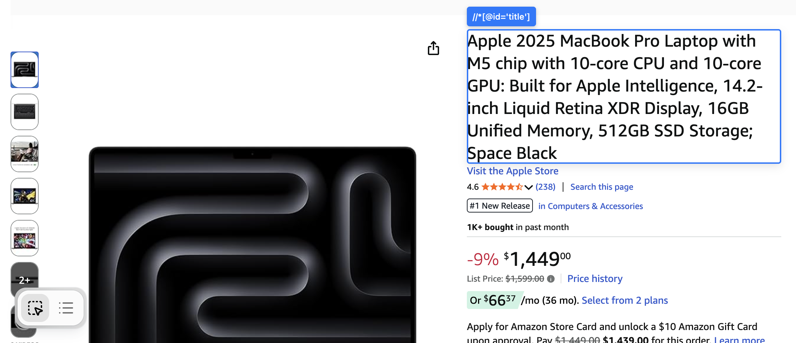
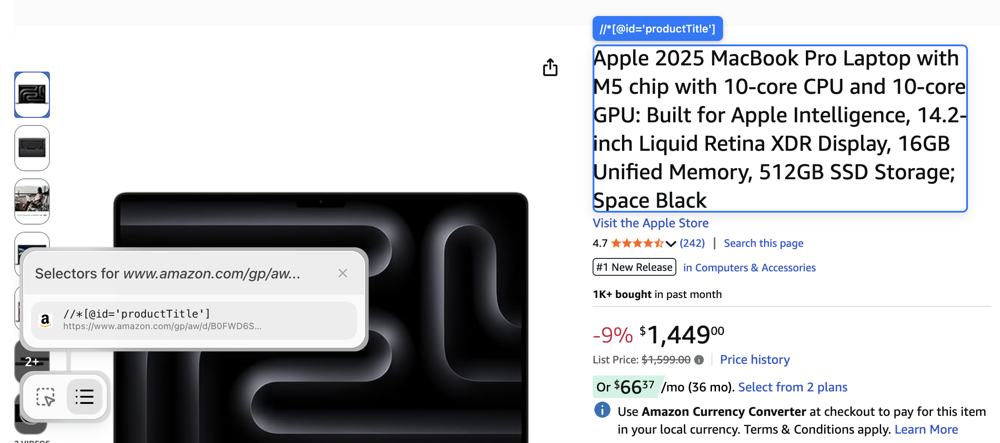

# XPath Generator Debugger (Chrome Extension)



A lightweight Chrome extension used to live-test the XPath generator against real pages. It renders a small UI overlay and shows the generated selector for the element you’re hovering, which makes it easy to iterate on heuristics and validate behavior outside fixtures.

This extension injects a React app into pages using Shadow DOM so it’s isolated from host page styles.

## What it’s for

- Validate selector quality on real sites quickly (before/after changes to heuristics)
- Spot edge cases that don’t show up in synthetic fixtures (dynamic layouts, personalization, responsive DOM changes)
- Inspect generated selectors in-context while hovering elements

## Install (build + load unpacked)

1. Install dependencies:

```bash
npm install
```

2. Build the extension:

```bash
npm run build
```

3. Load it in Chrome:

- Open `chrome://extensions/`
- Enable “Developer mode”
- Click “Load unpacked”
- Select the `dist` folder

## Usage

- Navigate to any page
- Use the bottom-left menu to enable selection or inspect saved selectors
- If you rebuild the extension, reload it in `chrome://extensions/` and refresh the page

## UI / controls

In the bottom-left corner of the page, the extension renders a small menu with two buttons:

- **Select icon**: toggles “selector mode”. Only when selector mode is enabled will the extension outline elements on the page and display the generated XPath for the currently hovered element.
  

- **List icon**: shows the list of saved selectors for the current site/page.
  

While selector mode is enabled:

- Clicking anywhere inside a highlighted element saves that element’s selector.
- Saved selectors are associated by host, and are only kept/considered when they still resolve on the current page (so they can be reused on similar pages on the same site).

## Development

Watch mode:

```bash
npm run dev
```

After each rebuild, reload the extension in Chrome to pick up the latest `dist` output.

## Project structure (high level)

```
src/
  content/          Content script that injects into pages
  App.tsx           Main React UI
  main.tsx          React entry point
  index.css         TailwindCSS styles
manifest.json       Chrome extension manifest
vite.config.ts      Vite configuration
tailwind.config.js  TailwindCSS configuration
```
